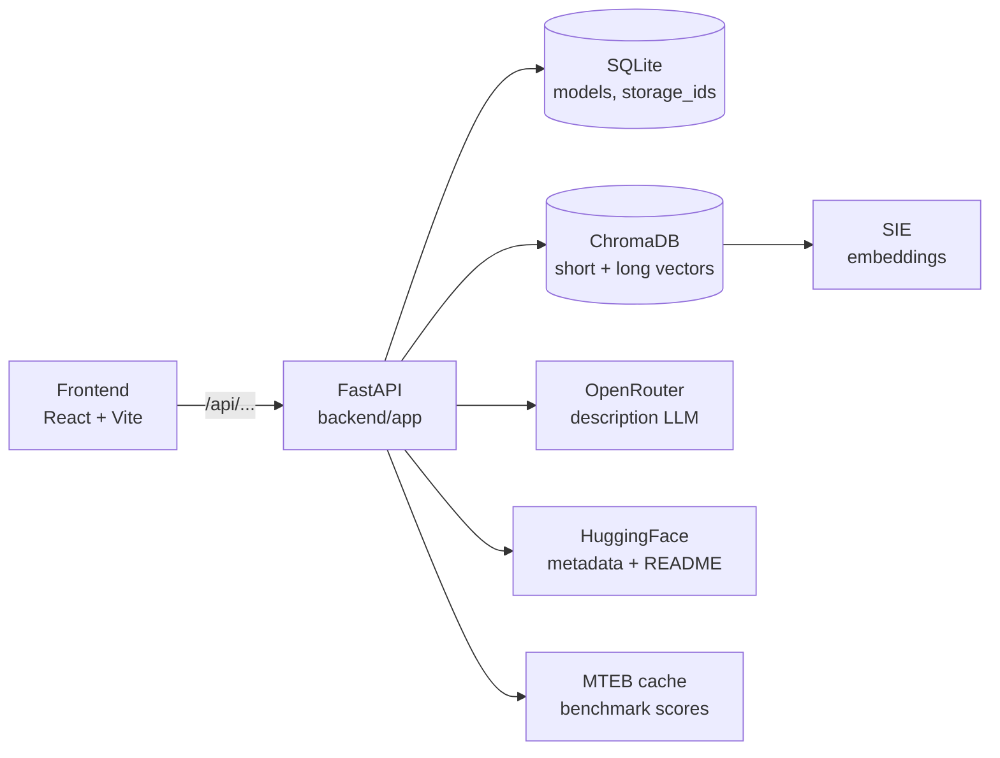

# Find SOTA embedding models by MTEB task

**You're using SIE and you need to pick a model.** SIE ships 100+
specialized models for encoding, reranking, and extraction (BGE,
Qwen3, Stella, ColBERT, ColPali, GLiNER, Florence-2, and more). Which
one is right for *your* task?

This tool is a semantic search over those models, ranked by MTEB
task-specific scores. Describe what you're building ("multilingual
long-document retrieval", "zero-shot entity extraction from invoices",
"reranking for financial search") and get back the SIE-ready model
identifier you can drop into `client.encode()`, `client.score()`, or
`client.extract()`. No scrolling through 85 model cards, no averaged
leaderboard numbers that hide task-specific tradeoffs.

The MTEB leaderboard only shows averaged scores and HF search is
keyword-only, so picking the right model for a specific task is harder
than it should be. This tool fills that gap and points you straight at
the SIE model IDs.

**Two modes.** *Zero-setup mode* runs a local text ranker against the
bundled demo catalog (no SIE, no API keys required, good for kicking
the tires). *Full mode* uses your SIE endpoint for embeddings and
OpenRouter for LLM-generated descriptions (the production path). Copy
`backend/.env.example` to `backend/.env` and fill in only the keys for
the mode you want. The sections below walk through both.

---

<p align="center">
  
</p>

## Table of contents

- [Architecture](#architecture)
- [Try It Locally First](#try-it-locally-first)
- [Project layout](#project-layout)
- [Prerequisites](#prerequisites)
- [Installation](#installation)
- [Configuration](#configuration)
- [How to use](#how-to-use)
- [Frontend](#frontend)
- [Data model](#data-model)
- [Search APIs](#search-apis)
- [Operations notes](#operations-notes)

---

## Architecture

- **Backend**: Python service in `backend/` (FastAPI + SIE):
  - SQLite in `backend/data/sqlite/sie.db` with tables `storage_ids` and `models`.
  - ChromaDB in `backend/data/chroma/` as the local vector store.
  - Superlinked Inference Engine (SIE) produces embeddings for short and long descriptions.
  - OpenRouter generates descriptions from HF metadata + README + MTEB scores.
- **Frontend**: TypeScript + React app in `frontend/` that calls the backend APIs for search, browse, and model details.



---

## Try It Locally First

You can run the project without a SIE endpoint, OpenRouter key, or Hugging Face token.
The repo includes a small bundled demo catalog plus a local text-ranking fallback.

```bash
cd backend
pip install -r requirements.txt
python cli_seed_demo.py
python -m uvicorn app.main:app --reload --port 8000

cd ../frontend
npm install
npm run dev
```

Then open <http://localhost:5173> and use storage id `demo`.

What works in local demo mode:

- browse the bundled model cards
- open model details and bundled READMEs
- run simple search and reranked search through the local fallback ranker

What still needs live services:

- downloading fresh Hugging Face model metadata
- generating descriptions through OpenRouter
- vector search and Chroma reindexing through a real SIE endpoint

---

## Why SIE Is Useful Here

This project is not just a model browser. It shows how SIE helps turn a large model catalog into a searchable product experience.

With SIE, the same application can start in a lightweight local demo mode and then move to live semantic search with real embeddings when you connect a running SIE endpoint. That makes it easier to prototype, evaluate, and operationalize search workflows without rebuilding the app around a different serving stack.

In practice, this example shows three concrete benefits:

- a single API surface for semantic search workflows
- a clear path from local exploration to live inference-backed search
- less custom infrastructure to wire together when testing retrieval ideas on real model metadata

---

## Project layout

```
sie-hugging-face-mteb-semantic-search/
├── backend/
│   ├── app/
│   │   ├── api/routes/        # FastAPI routers: models, generate, search, chroma
│   │   ├── db/                # SQLAlchemy models, session, migrations
│   │   ├── services/          # chroma, fallback search, llm, openrouter, sie_chroma
│   │   ├── prompts/           # description prompt templates (.md)
│   │   ├── config.py          # pydantic-settings, reads backend/.env
│   │   └── main.py            # FastAPI app factory
│   ├── cli_download.py        # download HF metadata + MTEB scores
│   ├── cli_generate.py        # generate short/long descriptions + index
│   ├── cli_reindex.py         # rebuild Chroma from existing descriptions
│   ├── cli_seed_demo.py       # seed bundled demo catalog for local use
│   ├── cli_sie_status.py      # inspect SIE server health + loaded models
│   ├── demo_models.json       # bundled demo data for public quickstart
│   ├── data/                  # sqlite/, chroma/, hf-cache/ (gitignored)
│   └── requirements.txt
├── frontend/
│   ├── src/App.tsx            # single-file React app, four tabs
│   └── package.json
├── assets/
└── README.md
```

---

## Prerequisites

- **Python 3.12** and `pip`.
- **Node.js 18+** and `npm`.
- An **OpenRouter** API key if you want to generate new descriptions.
- A running **SIE** endpoint if you want live vector indexing and embedding search. `SIE_API_KEY` is optional and only needed for managed/auth-enabled clusters.
- Optional: a **Hugging Face** token, useful for higher rate limits.

---

## Installation

Backend:

```bash
cd backend
pip install -r requirements.txt
```

Frontend:

```bash
cd frontend
npm install
```

---

## Configuration

All backend settings come from environment variables or `backend/.env`.
See `backend/app/config.py` for the full list; the important keys are:

| Variable              | Default                              | Purpose                                    |
|-----------------------|--------------------------------------|--------------------------------------------|
| `HF_TOKEN`            | _(empty)_                            | Optional, raises HuggingFace rate limits   |
| `OPENROUTER_API_KEY`  | _(empty, required for generation)_   | Auth for OpenRouter description calls      |
| `OPENROUTER_MODEL`    | `google/gemini-3.1-pro-preview`      | Default LLM used by CLI + UI               |
| `LLM_MAX_PARALLEL`    | `20`                                 | Max in-flight OpenRouter calls             |
| `SIE_API_ENDPOINT`    | _(empty, required for embeddings)_   | URL of the SIE server                      |
| `SIE_API_KEY`         | _(empty)_                            | Optional bearer token for managed/auth-enabled SIE clusters |
| `SIE_EMBED_MODEL`     | `NovaSearch/stella_en_400M_v5`       | Embedding model registered on SIE          |
| `SIE_EMBED_BATCH_SIZE`| `32`                                 | Texts per SIE encode call                  |
| `SQLITE_PATH`         | `data/sqlite/sie.db`                 | Local SQLite database path                 |
| `CHROMA_PATH`         | `data/chroma`                        | Local ChromaDB directory                   |

Minimal `backend/.env` for live services:

```env
OPENROUTER_API_KEY=sk-or-...
SIE_API_ENDPOINT=https://your-sie-host
# Optional: only needed for managed/auth-enabled SIE clusters.
SIE_API_KEY=
HF_TOKEN=hf_...        # optional
```

---

## How to use

### 0. Seed the bundled demo catalog

If you want the no-credentials path, seed the bundled local catalog first:

```bash
cd backend
python cli_seed_demo.py
```

Then use storage id `demo` in the UI.

### 1. Run the backend

```bash
cd backend
pip install -r requirements.txt
python -m uvicorn app.main:app --reload --port 8000
```

Verify: <http://localhost:8000/health> returns `{"status":"ok"}`.

### 2. Run the frontend

```bash
cd frontend
npm install
npm run dev
```

Then open <http://localhost:5173>. For the local demo flow, start with storage id `demo`.

### 3. Check the SIE server: `cli_sie_status.py`

Inspects liveness, readiness, loaded embedding models, and worker pools.

```bash
cd backend
python cli_sie_status.py              # full status report
python cli_sie_status.py --health     # /health only
python cli_sie_status.py --models     # list loaded models
python cli_sie_status.py --pools      # list worker pools
```

### 4. Download model metadata: `cli_download.py`

Selects the top MTEB-benchmarked models (ranked by number of benchmark tasks),
fetches their Hugging Face metadata in parallel, and stores everything under
a logical `storage_id` in SQLite.

```bash
cd backend

# Top 30 models, append to storage (default)
python cli_download.py test01

# Top 100 models, 20-way parallel HF fetch
python cli_download.py test01 --limit 100 --parallel 20

# Wipe the storage first (same as the web UI "Download" button)
python cli_download.py test01 --overwrite

# Show which models would be fetched without actually downloading
python cli_download.py test01 --dry-run
```

Demo READMEs are bundled locally. Live Hugging Face READMEs are fetched on demand
for downloaded models (see [Operations notes](#operations-notes)).

### 5. Generate descriptions and index: `cli_generate.py`

Runs the same pipeline as the web UI *Generate Descriptions* buttons:

1. Prepare 6K prompt (HF metadata + live README + MTEB summary).
2. Generate 6K detailed description via OpenRouter.
3. Generate 2K long description from the 6K output.
4. Generate 200-char short description from the 6K output.
5. Save short + long to SQLite.
6. Upsert both embeddings into ChromaDB via SIE.

```bash
cd backend

# All models in the storage, default parallelism (LLM_MAX_PARALLEL)
python cli_generate.py test01

# Single model only
python cli_generate.py test01 BAAI/bge-large-en-v1.5

# Skip models that already have short + long descriptions
python cli_generate.py test01 --skip-existing --parallel 50

# Override the default OPENROUTER_MODEL
python cli_generate.py test01 --model google/gemini-2.5-flash

# Rebuild Chroma from existing SQLite descriptions, skip LLM calls
python cli_generate.py test01 --reindex-only

# Prepare prompts but don't call the LLM or save
python cli_generate.py test01 --dry-run
```

### 6. Rebuild the vector index only: `cli_reindex.py`

Drops and rebuilds the `models_{storage_id}` Chroma collection from the
current SQLite descriptions. Useful if the vector DB is out of sync, or
after switching `SIE_EMBED_MODEL`.

```bash
cd backend
python cli_reindex.py test01
python cli_reindex.py test01 --batch-size 16
```

---

## Frontend

Single-page React app (`frontend/src/App.tsx`) with four tabs, in this order:

1. **Search with Reranking**: the recommended entry point. Runs a short-description
   kNN, then reranks the candidates by long-description similarity. Calls
   `POST /api/search/semantic-rerank`.
2. **Simple search**: single-stage semantic search on short descriptions. Calls
   `POST /api/search/semantic`.
3. **Download LLM Cards**: triggers `POST /api/models/download` to (re)populate
   a storage with the top MTEB-benchmarked HF models.
4. **Browse LLM Cards**: filters stored models by `storage_id` and optional
   `hf_id` substring; each row opens a full detail view with MTEB scores, the
   live HF README, and a *Generate descriptions* modal.

The Search with Reranking tab is the default when the app loads.

A full walk-through of the UI fields and modals lives in
[`frontend/frontend.md`](frontend/frontend.md).

---

## Data model

### Table `storage_ids`

| Column        | Type     | Notes                           |
|---------------|----------|---------------------------------|
| `id`          | int PK   |                                 |
| `storage_id`  | string   | Unique, indexed (e.g. `test01`) |
| `description` | string?  | Free-text                       |
| `created_at`  | datetime | Server default                  |

### Table `models`

| Column              | Type         | Notes                                                    |
|---------------------|--------------|----------------------------------------------------------|
| `id`                | int PK       |                                                          |
| `storage_id`        | int FK       | Cascades to `storage_ids.id`                             |
| `hf_id`             | string       | HuggingFace model id, indexed                            |
| `created_at`        | datetime     | When this row was stored locally                         |
| `created_at_hf`     | datetime?    | HF model creation time                                   |
| `last_modified`     | datetime?    | HF last modified                                         |
| `author`, `sha`     | string?      |                                                          |
| `private`, `disabled` | bool?      |                                                          |
| `downloads`, `downloads_all_time`, `downloads_30d`, `likes`, `trending_score` | numeric? | HF metrics |
| `tags`              | JSON         | HF tag array                                             |
| `pipeline_tag`, `library_name`, `mask_token` | string? |                                             |
| `config`, `card_data` | JSON       | Small structured HF metadata                             |
| `mteb_scores`       | JSON         | Compact `[{task_name, main_score}, ...]`, averaged per task |
| `short_description` | varchar(200) | ≤ 200 characters                                         |
| `long_description`  | varchar(2048)| ≤ 2048 characters                                        |

**Not stored locally:** `readme`, `siblings`, `safetensors`, `spaces`, and the
raw nested MTEB per-subset/per-split JSON: these would blow SQLite past several
GB across the full catalog.

### Chroma collection `models_{storage_id}`

Holds **two entries per model**:

- id `"{hf_id}::short"` with `kind="short"`: embedding of `short_description`.
- id `"{hf_id}::long"` with `kind="long"`: embedding of `long_description`.

Both are produced by the same `SIEEmbeddingFunction`. The `kind` metadata lets
each search endpoint filter to the right set.

---

## Search APIs

Semantic search lets users describe a task in plain language and find the
embedding models whose descriptions are closest in meaning. Two endpoints
are available: a single-stage short-description search and a two-stage
rerank search.

Both share the same request shape:

```json
{
  "storage_id": "test01",
  "query": "evaluate medical pictures",
  "n_results": 20
}
```

### `POST /api/search/semantic`: single stage

Embeds the query, kNN-searches the `kind="short"` entries, returns up to
`n_results` models sorted by cosine distance.

Response:

```json
{
  "storage_id": "test01",
  "query": "evaluate medical pictures",
  "results": [
    { "hf_id": "BAAI/bge-large-en-v1.5", "distance": 0.123, "short_description": "..." }
  ]
}
```

### `POST /api/search/semantic-rerank`: two stage

1. **Stage 1: short kNN:** `collection.query(query_texts=[query], n_results=N, where={"kind": "short"})`
   returns candidate models with their short-distance scores.
2. **Stage 2: long rerank:** `collection.query(query_texts=[query], n_results=len(candidates), where={"$and": [{"kind": "long"}, {"hf_id": {"$in": candidates}}]})`
   makes Chroma recompute cosine distance against only those candidates' long vectors.
3. Results are merged by `hf_id`, sorted by `rerank_distance` ascending;
   any candidate without a long embedding falls back to `short_distance`
   and is appended at the end.

Response:

```json
{
  "storage_id": "test01",
  "query": "evaluate medical pictures",
  "results": [
    {
      "hf_id": "BAAI/bge-large-en-v1.5",
      "rerank_distance": 0.087,
      "short_distance": 0.123,
      "short_description": "..."
    }
  ]
}
```

`rerank_distance` is `null` for any fallback item.

### Index population

- **Auto:** `POST /api/generate/save` calls `upsert_embedding(storage_id, hf_id, short, long)`
  after every save, keeping both Chroma entries in sync. Clearing a description
  deletes that `kind`'s entry.
- **Bulk (re)build:** `python cli_reindex.py <storage_id>`: see [How to use](#6-rebuild-the-vector-index-only--cli_reindexpy).

---

## Operations notes

### Why README is not stored locally

At 14,000 models, storing HF READMEs in SQLite blows the database past several
GB. Instead, only small fields live in SQLite (metadata, tags, compact MTEB
scores, the two generated descriptions). The full README is fetched **live
from HuggingFace** via `GET /api/models/readme/{hf_id}` whenever the user
opens a detail view, and for description generation (`ModelCard.load(hf_id).text`
truncated to 4000 chars). A small in-memory LRU avoids hammering HF.

### Migrating from older schemas

Earlier versions also stored `readme`, `siblings`, `safetensors`, `spaces`,
and the raw nested `mteb_results`. If you're migrating an existing DB:

```bash
cd backend
python cli_download.py <storage_id> --overwrite
sqlite3 data/sqlite/sie.db "VACUUM;"
```

SQLite does not shrink on its own after row deletes: the `VACUUM;` step
is what actually reclaims disk.

### Description generation pipeline

The CLI and UI both follow the same six-step pipeline:

1. Render the **6K detailed** prompt from model JSON, live README (4K chars max), and MTEB summary.
2. Call OpenRouter → **6K detailed description** (not persisted).
3. Call OpenRouter with the 6K text → **2K long description**.
4. Call OpenRouter with the 6K text → **200-char short description**.
5. Save short + long into the `models` table.
6. Upsert short + long embeddings into ChromaDB via SIE.

Prompt templates live in `backend/app/prompts/*.md` and can be edited
without touching Python code.
