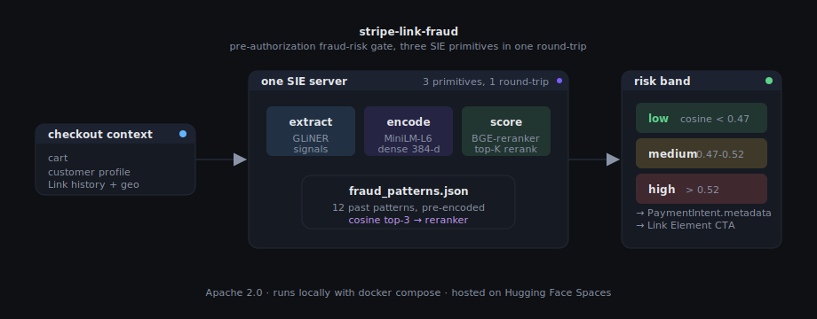
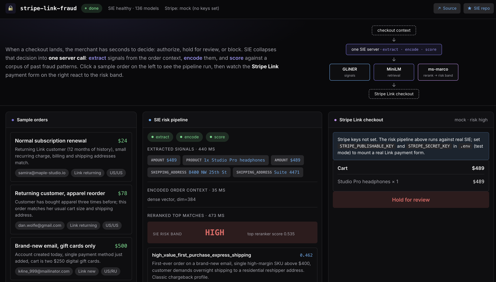

# stripe-link-fraud

**A Stripe Link checkout with an SIE-driven fraud-risk gate in one round-trip.**

Three SIE primitives (`extract`, `encode`, `score`) score every order
against a corpus of past fraud patterns before a Stripe PaymentIntent is
created. The risk band that comes out the other side annotates the
Stripe Link payment button, in the same UI, in the same request.





> Built on [SIE](https://github.com/superlinked/sie), the open-source
> inference engine from Superlinked, plus
> [Stripe.js + Stripe Link](https://stripe.com/payments/link). Apache 2.0.
> Run it locally with `docker compose up` + `npm start`.

---

## What this demo actually shows

Imagine you run a small e-commerce shop. You added Stripe Link to your
checkout because the one-click experience for returning shoppers really
does lift conversion. Three months in, the chargebacks start. Not from
the returning Link customers (those are golden); from the brand-new
signups: a brand-new email opens an account, adds a gift card, pays with
Link, the card is stolen, and twenty days later the issuer claws the
money back. You eat the loss and the fee.

The natural reaction is to bolt on a fraud-scoring SaaS. That works.
It also adds a third auth flow, a fourth SDK, a fifth vendor that needs
to see your customer's email and shipping address, and a compliance
review that takes two months.

This demo shows the other path: **the fraud scoring runs against the
same SIE server your search and embeddings already run against**. Three
SIE primitives, three lines of code:

```ts
// 1. Extract typed signals from the order context
const entities = await client.extract(
  "urchade/gliner_multi-v2.1",
  { text: orderSummary },
  { labels: ["product", "shipping_address", "email_domain", "amount"] },
);

// 2. Encode the context into a dense vector
const { dense } = await client.encode(
  "sentence-transformers/all-MiniLM-L6-v2",
  { text: orderSummary },
);

// 3. Rerank top-K fraud patterns (cosine retrieval picked the candidates)
const { scores } = await client.score(
  "BAAI/bge-reranker-base",
  { text: orderSummary },
  topKFraudPatterns,
);
```

The output is a low / medium / high band. The Stripe Link
PaymentElement reflects that band: the button stays "Pay with Link" for
low risk, flips to "Hold for review" for high risk. The actual
authorization still goes through Stripe; the risk band just tells the
UI (and your downstream operations team) how much trust to give this
one transaction.

---

## How this relates to Stripe Link specifically

Stripe Link is the saved-payment-method wallet that powers one-click
checkout across Stripe-using merchants. Conversion-wise it's a huge
win: a returning shopper sees their card pre-filled and a "Pay" button,
done. But that same low-friction surface is exactly where account
takeover and synthetic-identity fraud likes to hide. The customer looks
like a returning Link shopper because their *email* matches a Link
account; meanwhile their *behavior* (new device, new shipping address,
velocity spike) does not match.

This demo's pipeline runs at the moment a `PaymentIntent` is being
created with Link enabled (`automatic_payment_methods: { enabled: true }`).
The order context, the customer's Link status, their geography, and the
cart shape are all fed into the SIE pipeline. The risk band is written
onto the PaymentIntent as `metadata.sie_risk_band`; what you do with
that downstream (Stripe Radar rules, your own ops queue, a webhook into
a fraud tool) is up to you. Downstream in this demo:

- a **low** band lets the Stripe Link Element mount normally and the
  customer pays with one click;
- a **medium** band still authorizes but tags the intent for review
  inside Stripe Dashboard (or your own ops tool) via
  `metadata.sie_risk_band`;
- a **high** band keeps the PaymentElement disabled with a "Hold for
  review" CTA, so a human checks the order before the charge goes
  through.

The Link flow is not bypassed and not duplicated. The risk gate is
purely advisory and informational. The same SIE server that runs this
fraud-scoring also runs the merchant's search, product embeddings, and
any other ML in the stack, so there is no second inference vendor to
onboard.

---

## Run it locally

```bash
git clone https://github.com/superlinked/sie
cd sie/examples/stripe-link-fraud
cp .env.example .env
npm install
npm start
```

`npm start` runs `docker compose up -d` (boots
`ghcr.io/superlinked/sie-server:latest-cpu-default`, preloads the three
small models, ~440 MB total) and starts a Node UI server at
<http://localhost:3033>.

- **First start**: ~3-5 minutes (one-time image + model download).
- **Subsequent restarts**: ~30-60 seconds. Weights cache in the
  `sie-cache` Docker volume.
- **Per-click runtime**: ~1 second once the models are hot.

### Plugging in your Stripe Link keys

The demo runs **without** Stripe keys: the SIE risk panel is fully
functional, and the right-hand checkout panel shows a mock "Pay with
Link" button. To switch on the real Stripe.js + Link flow, drop your
test-mode keys in `.env`:

```bash
STRIPE_PUBLISHABLE_KEY=pk_test_...
STRIPE_SECRET_KEY=sk_test_...
```

Grab them at <https://dashboard.stripe.com/test/apikeys>. With keys set,
the backend calls
`stripe.paymentIntents.create({ automatic_payment_methods: { enabled: true } })`,
which is the same call you make in production: Stripe decides whether
to expose Link, card, Apple Pay, etc. based on your account and the
customer.

Test card numbers live at <https://docs.stripe.com/testing#cards>.
`4242 4242 4242 4242` always succeeds; `4000 0025 0000 3155` triggers
3D Secure.

---

## Specific things to try in the UI

The left panel ships five sample orders that exercise the pipeline:

| Order | Customer profile | Expected band |
|---|---|---|
| Normal subscription renewal | Returning Link customer, 12 months of history | **low** |
| Returning customer, apparel reorder | Repeat shopper, normal cart size | **low** |
| Brand-new email, gift cards only | New account, mailinator email, IP=RU | **medium** (matches `gift_card_resale`) |
| First order, high value, overnight to reshipper | New account, $489 single SKU, freight forwarder shipping | **high** (matches `high_value_first_purchase_express_shipping`) |
| Established account, sudden velocity spike | Long-standing customer, 4 orders in 30 min | low (subtle; cosine misses) |

Click each in turn and watch the right panel react. The "velocity spike"
case intentionally misses because cosine + cross-encoder over a small
corpus catches obvious fraud-pattern matches but does not replace
velocity feature engineering. A production stack would combine SIE's
similarity signal with traditional rules.

---

## What the numbers in the UI mean

The risk panel shows three numeric scores. Here is what each one is:

1. **GLiNER confidence (next to each extracted entity).** The model's
   confidence (0 to 1) that the highlighted span really is an instance
   of the labeled entity type (`product`, `shipping_address`, etc.).
   GLiNER is doing zero-shot NER, so this is genuine confidence and
   not a softmax over a fixed label set.
2. **Cosine top score (in the risk band).** Cosine similarity between
   the order-context embedding and the nearest fraud-pattern embedding
   in the corpus. Range 0 to 1, where 1 would mean the order's vector
   is identical to a fraud pattern. This is the value the band
   thresholds are applied to.
3. **Reranker score (right of each candidate).** Cross-encoder
   relevance score from `BAAI/bge-reranker-base` for *this* order paired
   with *this* candidate fraud pattern. The model returns a 0 to 1
   score. The top-3 candidates from cosine retrieval are reranked and
   reordered by this value, which is sharper than cosine for close-call
   cases.

Bands are derived from the cosine top score, not the reranker score,
because cosine has a wider usable spread for this kind of semantic
similarity. The reranker is used to order the displayed candidates,
not to threshold the band. Both thresholds live in `src/config.ts`:

```ts
risk: {
  blockThreshold: 0.47,
  reviewThreshold: 0.52,
  topKRerank: 3,
}
```

When you swap in real fraud data, expect to re-tune both thresholds by
sampling the cosine distribution on a held-out set.

---

## Model lineup

| Stage | Model | Size | Role |
|---|---|---|---|
| Extract | `urchade/gliner_multi-v2.1` | 280 MB | zero-shot NER on the order summary |
| Encode | `sentence-transformers/all-MiniLM-L6-v2` | 80 MB | 384-dim dense encoder for cosine retrieval |
| Score | `BAAI/bge-reranker-base` | 280 MB | cross-encoder reranker on the top-K candidates |

All three live in SIE's `default` bundle and ship with the
`latest-cpu-default` Docker image. To swap any of them, edit
`src/config.ts` (the model IDs) and the preload list in `compose.yml`.

---

## SIE features used

- `extract` for zero-shot NER on the order context
- `encode` for dense retrieval against the fraud-pattern corpus
- `score` for cross-encoder reranking of the top-K candidates

---

## Why SIE specifically for this

You could build this gate with three SaaS services: a hosted NER API, a
hosted embeddings API, a hosted reranking API. That works. It also adds:

- **Three vendors that see your order data.** Email addresses, billing
  details, cart contents. Each one a separate data-processing agreement
  for your legal team to negotiate.
- **Three auth flows, three rate-limit budgets, three SDKs.** Each with
  its own retry semantics and outage stories.
- **A second inference stack** alongside whatever you already run for
  product search and recommendations.

SIE collapses all of that into one process:

- **One server, three primitives.** `extract`, `encode`, `score`. The
  same server can power your product search and your fraud gate from
  the same process; you don't pay double.
- **One SDK call shape.** `client.<primitive>(model_id, item)` is the
  whole API. Swap a model ID in `src/config.ts` to try a different
  encoder or reranker without touching any application code.
- **Open source, runs in your VPC.** Customer order data never leaves
  the host running this compose. Compliance teams stop blocking you.
- **Same code laptop to Kubernetes.** SIE ships a Helm chart, KEDA
  autoscaling, and Terraform modules for GKE/EKS. This demo's code
  runs unchanged against a production cluster; only the URL changes.

---

## What's in the box

```
src/
  config.ts          SIE + Stripe config, model IDs, risk thresholds
  events.ts          typed SSE events streamed to the browser
  risk.ts            extract → encode → score pipeline
  index-build.ts     one-time corpus encoder
  types.ts           order, customer, fraud-pattern, index types

data/
  fraud_patterns.json   12 synthetic historical fraud patterns
  sample_orders.json    5 sample carts + customer profiles

web/
  server.ts          Node http server, /api/run SSE, /api/payment-intent
  public/            index.html, style.css, app.js, architecture.svg

compose.yml          local docker compose up
.env.example         Stripe test keys + SIE URL
docs/architecture.svg  diagram you saw at the top of this README
docs/screenshot.png    UI screenshot
```

About 1,400 lines total. No bundler, no React, no build step. The UI
is vanilla HTML + CSS + JavaScript driven by `EventSource` for the SSE
stream from the Node server.

---

## Extend it

- **Swap the corpus.** Replace `data/fraud_patterns.json` with your own
  historical chargebacks, then `npm run index` to re-encode. Threshold
  values in `src/config.ts` will need re-tuning on a held-out set.
- **Try a different encoder.** All three model IDs live in
  `src/config.ts`. Drop in `intfloat/e5-small-v2` for encoder, or
  `mixedbread-ai/mxbai-rerank-large-v2` for a stronger cross-encoder.
  No code change.
- **Push the band into Stripe Radar.** The demo writes the band as
  `metadata.sie_risk_band` on the PaymentIntent; a Radar rule like
  `:metadata['sie_risk_band']: == 'high'` can `block` or `review`
  inside Stripe's existing pipeline.
- **Add a second signal.** Combine the cosine band with traditional
  velocity / device-fingerprint rules. The SIE primitives compose; an
  agentic harness sitting in front can call `score` for the similarity
  gate and `extract` again for IP geolocation parsing in the same
  round-trip.

---

## Honest scope and known limits

- **The fraud-pattern corpus is synthetic and tiny** (~12 patterns).
  Real systems use thousands and tag patterns by industry and merchant
  vertical. SIE supports re-indexing live; the demo just doesn't show
  it.
- **Subtle patterns are missed.** Velocity, device fingerprinting, and
  behavioral anomalies need feature engineering beyond text similarity.
  The demo intentionally lets one "velocity spike" sample miss to make
  this honest.
- **Stripe test mode only.** Don't point this at live keys; the risk
  band is informational and does not currently gate
  `PaymentIntent.create`. Production wiring would either block the
  intent above a threshold or push the band into Stripe Radar via
  metadata.
- **Apple Silicon performance is poor** because the SIE Docker image is
  `linux/amd64` only and runs through Rosetta. On Linux x86_64, the
  whole `extract+encode+score` chain completes in ~200 ms.

---

## Built with

- [SIE](https://github.com/superlinked/sie) (Apache 2.0): the inference
  engine that hosts all three model classes
- [Stripe Link](https://stripe.com/payments/link) via
  [Stripe.js + Elements](https://docs.stripe.com/payments/elements)
  (test mode by default)
- [GLiNER](https://huggingface.co/urchade/gliner_multi-v2.1) (Apache 2.0):
  zero-shot NER
- [sentence-transformers/all-MiniLM-L6-v2](https://huggingface.co/sentence-transformers/all-MiniLM-L6-v2)
  (Apache 2.0): 22M-param dense encoder
- [BAAI/bge-reranker-base](https://huggingface.co/BAAI/bge-reranker-base)
  (MIT): general-purpose cross-encoder

Star [superlinked/sie](https://github.com/superlinked/sie) if this was
useful.
