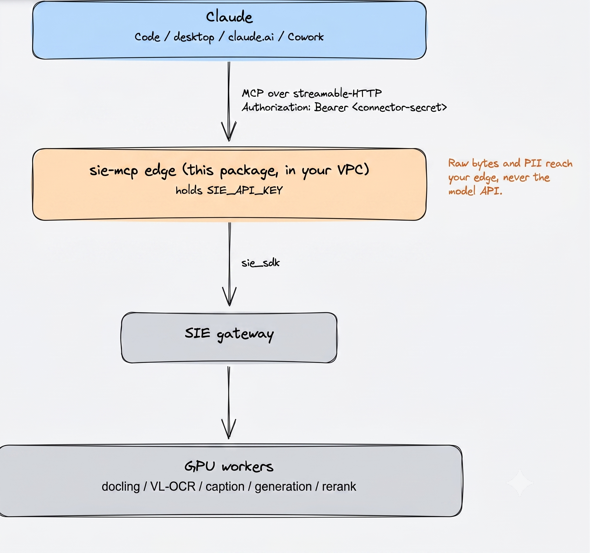

# sie-mcp: the SIE MCP edge

Run SIE's document jobs as an MCP server **in your own cloud**. Any Claude surface
(Claude Code, the desktop app, claude.ai, Cowork) connects to it and offloads heavy,
private document work to open models on your GPUs, then works from the small artifact it
gets back. The raw bytes and any PII reach your edge, never the model API.

`sie-mcp` is a lightweight `sie_sdk` client: no GPU and no model weights. It holds one
cluster credential, exposes the document tools below over streamable-HTTP MCP, and
authenticates clients with a connector secret.



> Editable source: [`docs/architecture.excalidraw`](docs/architecture.excalidraw), open at [excalidraw.com](https://excalidraw.com) or the VS Code / Obsidian Excalidraw plugin.

The package is two things:

- **The server** you deploy: `sie-mcp serve`.
- **The install-pack generator** users run to connect: `sie-mcp plugin-pack`. It packages the
  document skills (parse, summarize, entity extraction, PII redaction) as MCP-backed Claude
  Code and claude.ai install assets, so users process large documents without reading the
  source files into agent context.

New here? Jump to [Try it in two minutes](#quick-install-for-an-existing-hosted-edge).

## What It Exposes

The MCP server exposes these tools:

- `docs_to_markdown`: convert PDF, scans, images of pages, Office files, or HTML
  to markdown.
- `summarize_document`: summarize a document or text input through the cluster.
- `extract_entities`: extract zero-shot entity labels such as person,
  organization, date, or amount.
- `redact_pii`: return redacted text and redaction counts.
- `answer_questions`: answer questions grounded in supplied document text.
- `describe_image`: caption and classify an image.
- `extract_structured`: extract schema-valid JSON from document text.
- `generate_structured`: generate constrained JSON, regex, or grammar output.

The generated Claude Code skill pack includes:

- `superlinked-docs`: general document offload skill.
- `parse-document`: calls `docs_to_markdown`.
- `summarize-document`: calls `summarize_document`.
- `extract-entities`: calls `extract_entities`.
- `redact-pii`: calls `redact_pii`.

The redaction MCP tool intentionally does not return a placeholder-to-original
map. That keeps original PII from being handed back to the calling model. Use the
older local `sie_tools` redaction flow from PR #1336 if a de-redaction map is
required.

## Credentials Model

There are two different credentials:

- Server operator credential: `SIE_API_KEY`, used by the MCP edge to call the SIE
  cluster gateway. Only the edge process should have this.
- Connector credential: `SIE_MCP_CONNECTOR_SECRETS`, used by users or agent
  surfaces to authenticate to `/mcp`. Give users this connector secret, not the
  cluster API key.

The edge also needs `SIE_BASE_URL`, the gateway URL for the SIE cluster. For an
in-cluster Helm deployment this can be left unset and the chart points at the
gateway service.

## Quick Install For An Existing Hosted Edge

Use this when an operator has already given you:

- An MCP URL such as `https://<mcp-host>/mcp`.
- A connector secret.

From the repo root:

```bash
export SIE_MCP_URL="https://<mcp-host>/mcp"
export SIE_MCP_CONNECTOR_SECRET="<connector-secret>"

mise run mcp-plugin-pack -- \
  --cluster-label sie-test \
  --mcp-url "$SIE_MCP_URL"
```

The generated pack is written to
`packages/sie_mcp/dist/superlinked-docs-plugin/` and contains:

- `INSTALL.md`: endpoint-specific install commands.
- `superlinked-docs-skill.zip`: uploadable claude.ai skill ZIP.
- `claude-code/*/SKILL.md`: Claude Code skills in local skill layout.
- `cowork/superlinked.md`: Cowork install notes, when included.

Install it into Claude Code:

```bash
cd packages/sie_mcp/dist/superlinked-docs-plugin

claude mcp add --scope user --transport http superlinked-docs \
  "$SIE_MCP_URL" \
  --header "Authorization: Bearer $SIE_MCP_CONNECTOR_SECRET"

mkdir -p ~/.claude/skills
cp -R claude-code/* ~/.claude/skills/
```

Restart Claude Code after adding the MCP server and skills.

## Generate Only The claude.ai Skill ZIP

Use the full plugin pack for normal installs. If you only need the uploadable
claude.ai skill ZIP:

```bash
mise exec -- uv run --package sie-mcp python -m sie_mcp.cli skill-zip
```

By default this writes
`packages/sie_mcp/dist/superlinked-docs-skill.zip`.

## Run A Local Edge Against A Cluster

Use this when you have a cluster gateway URL and, if required, a cluster API key.
This starts only the lightweight MCP edge locally; document processing still runs
on the configured SIE cluster.

```bash
export SIE_BASE_URL="https://<cluster-gateway>"
export SIE_API_KEY="<cluster-api-key>"                 # omit if the gateway has no auth
export SIE_MCP_CONNECTOR_SECRETS="local-dev-secret:local-dev"

mise run mcp-serve -- --host 127.0.0.1 --port 8088
```

In another shell, verify the server:

```bash
curl -s http://127.0.0.1:8088/healthz
curl -s -o /dev/null -w "%{http_code}\n" http://127.0.0.1:8088/mcp
```

Expected result:

- `/healthz` returns `{"status":"ok"}`.
- `/mcp` returns `401` without a connector secret.

## Model And GPU Selection

The skills and the calling agent are model-agnostic. Each tool picks its model
on the edge, in this order: the call's optional `model` argument (the skills do
not pass one), then the env var below, then a built-in default.

| Tool(s) | Model env var | Default |
| --- | --- | --- |
| `docs_to_markdown` | `SIE_MCP_DOCLING_MODEL`, `SIE_MCP_VLOCR_MODEL` | `docling`, MinerU2.5-Pro |
| `extract_entities` | `SIE_MCP_EXTRACT_MODEL` | `urchade/gliner_multi-v2.1` |
| `redact_pii` | `SIE_MCP_PII_MODEL` | `urchade/gliner_multi_pii-v1` |
| `describe_image` | `SIE_MCP_CAPTION_MODEL`, `SIE_MCP_EMBED_MODEL` | Florence-2, CLIP |
| `summarize_document`, `extract_structured`, `generate_structured` | `SIE_MCP_GENERATE_MODEL` | `Qwen/Qwen3.5-4B` |
| `answer_questions` | `SIE_MCP_ENCODE_MODEL`, `SIE_MCP_RERANK_MODEL`, `SIE_MCP_GENERATE_MODEL` | bge-m3, bge-reranker, the generate model |

**GPU lanes.** `SIE_MCP_GPU` sets the default lane for every tool. Each tool also
has a per-tool override that falls back to `SIE_MCP_GPU` when unset, so a
multi-lane cluster can route each tool to its own hardware (e.g. embeddings on
`l4`, generation on `rtx6000`):

| Tool(s) | GPU env var |
| --- | --- |
| `docs_to_markdown` | `SIE_MCP_DOCS_GPU` |
| `extract_entities`, `redact_pii` | `SIE_MCP_EXTRACT_GPU` |
| `summarize_document`, `extract_structured`, `generate_structured` | `SIE_MCP_GENERATE_GPU` |
| `describe_image` | `SIE_MCP_IMAGE_GPU` |
| `answer_questions` | `SIE_MCP_QA_GPU` |

Example for a cluster whose 4B generation model is pinned on `rtx6000`:

```bash
export SIE_MCP_GENERATE_MODEL="Qwen/Qwen3.5-4B"   # already the default
export SIE_MCP_GENERATE_GPU="rtx6000"             # route generation to its lane
export SIE_MCP_GPU="l4"                            # everything else on l4
```

## Smoke Test The MCP Tool Path

The repository includes a small MCP client at
`packages/sie_mcp/docs/examples/mcp_smoke.py`. It connects exactly like a
connector client: remote streamable HTTP plus an Authorization bearer secret.

List the tools:

```bash
mise exec -- uv run --package sie-mcp python packages/sie_mcp/docs/examples/mcp_smoke.py \
  --url http://127.0.0.1:8088/mcp \
  --secret local-dev-secret \
  --list
```

Convert a sample HTML document to markdown:

```bash
mise exec -- uv run --package sie-mcp python packages/sie_mcp/docs/examples/mcp_smoke.py \
  --url http://127.0.0.1:8088/mcp \
  --secret local-dev-secret \
  --file packages/sie_mcp/docs/examples/sample.html \
  --filename sample.html \
  --engine docling
```

For a quick custom document:

```bash
printf '<h1>Hello</h1><p>local smoke test</p>' > /tmp/sie-mcp-smoke.html

mise exec -- uv run --package sie-mcp python packages/sie_mcp/docs/examples/mcp_smoke.py \
  --url http://127.0.0.1:8088/mcp \
  --secret local-dev-secret \
  --file /tmp/sie-mcp-smoke.html \
  --filename smoke.html \
  --engine docling
```

The first model-backed request can be slow while the cluster loads models.

## Run The Tests

Run the package tests from the repo root:

```bash
mise exec -- uv run --package sie-mcp python -m pytest packages/sie_mcp/tests
```

For a focused check of this plugin-pack and PR #1336 integration path:

```bash
mise exec -- uv run --package sie-mcp python -m pytest \
  packages/sie_mcp/tests/test_offload.py \
  packages/sie_mcp/tests/test_plugin_pack.py \
  packages/sie_mcp/tests/test_skill_zip.py
```

Useful lightweight checks:

```bash
bash -n tools/mise_tasks/mcp-plugin-pack.bash
git diff --check
```

## Generate A Plugin Pack For The Local Edge

Once the local edge is running, generate an install pack that points at it:

```bash
SIE_MCP_CONNECTOR_SECRET=local-dev-secret mise run mcp-plugin-pack -- \
  --cluster-label local-dev \
  --mcp-url http://127.0.0.1:8088/mcp \
  --out-dir /tmp/sie-mcp-plugin-pack
```

Then follow `/tmp/sie-mcp-plugin-pack/INSTALL.md`.

## Build And Run The Docker Server

Build with the repo's Docker task:

```bash
mise run docker -- --mcp --docker-platform linux/amd64 --bake-tag local
```

Or build directly:

```bash
docker build -t sie-mcp:local -f packages/sie_mcp/Dockerfile .
```

Run the container:

```bash
docker run --rm -p 8088:8088 \
  -e SIE_BASE_URL="$SIE_BASE_URL" \
  -e SIE_API_KEY="$SIE_API_KEY" \
  -e SIE_MCP_CONNECTOR_SECRETS="local-dev-secret:local-dev" \
  sie-mcp:local
```

Then reuse the smoke-test commands above with
`http://127.0.0.1:8088/mcp`.

## Deploy With Helm

The Helm chart has an optional `mcpEdge` section. A typical hosted deployment has
one public HTTPS host for the MCP edge and a connector secret for users.

Create the connector secret:

```bash
kubectl -n sie create secret generic sie-mcp-connector-secrets \
  --from-literal=connector-secrets="tester-secret:tester"
```

If the edge calls an external gateway that requires a cluster API key, create a
separate secret for that server-side key:

```bash
kubectl -n sie create secret generic sie-mcp-cluster-api-key \
  --from-literal=api-key="<cluster-api-key>"
```

Enable the edge:

```bash
helm upgrade sie deploy/helm/sie-cluster -n sie --reuse-values \
  --set mcpEdge.enabled=true \
  --set mcpEdge.image.repository=ghcr.io/superlinked/sie-mcp \
  --set mcpEdge.image.tag=<tag> \
  --set mcpEdge.existingSecretName=sie-mcp-connector-secrets \
  --set mcpEdge.publicUrl=https://<mcp-host> \
  --set mcpEdge.ingress.enabled=true \
  --set mcpEdge.ingress.host=<mcp-host>
```

For an external gateway instead of the in-cluster gateway, add:

```bash
--set mcpEdge.clusterBaseUrl=https://<cluster-gateway> \
--set mcpEdge.clusterApiKey.existingSecretName=sie-mcp-cluster-api-key
```

Verify:

```bash
kubectl -n sie rollout status deploy/sie-mcp --timeout=180s
curl -s https://<mcp-host>/healthz
```

Then generate a user install pack:

```bash
SIE_MCP_CONNECTOR_SECRET=tester-secret mise run mcp-plugin-pack -- \
  --cluster-label <cluster-name> \
  --mcp-url https://<mcp-host>/mcp
```

## How Users Use It In Claude Code

After installing the generated pack, users can ask Claude Code to process files
without reading the source file into context directly. Examples:

```text
Parse ./contracts/vendor-agreement.pdf.
Summarize ./reports/quarterly-board-pack.pdf.
Extract person, organization, date, and amount entities from ./invoices/batch.pdf.
Redact PII from ./support/customer-ticket.pdf.
```

The skill instructions tell Claude Code to:

1. Read source bytes only.
2. Base64-encode the bytes.
3. Call the connected Superlinked MCP tool.
4. Write returned artifacts under `processed/`.
5. Answer from the processed artifact instead of the original file.

## Troubleshooting

`401` from `/mcp` means the connector secret is missing or wrong. Re-run the
generated `claude mcp add ... --header "Authorization: Bearer ..."` command from
`INSTALL.md`.

`/healthz` works but tools fail usually means the edge cannot call the SIE
cluster. Check `SIE_BASE_URL`, `SIE_API_KEY`, and cluster worker availability.

The first document request can take longer than later requests because model
workers may need to start or load weights.

claude.ai custom connectors require a public HTTPS MCP URL and the OAuth bridge.
Set `SIE_MCP_PUBLIC_URL=https://<mcp-host>` for hosted deployments so OAuth
metadata contains stable public URLs.
